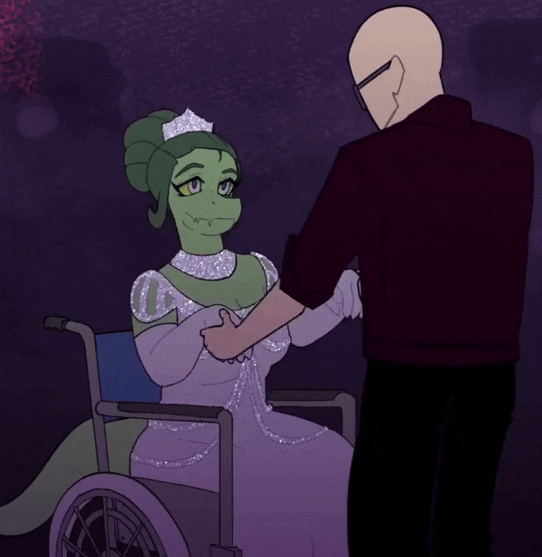
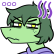
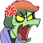

  <!-- Circular GIF Avatar -->
  

    

  <!-- Dual-Color Cozy Handwritten Header (SVG) -->

    
    
  

  <!-- Cozy Subtitle -->

    
    <i>A student on a journey to find mine own path.</i> 
    
  

   

  <!-- Emoticon Showcase Bar -->
  

    
    
    
    
    
    
  

